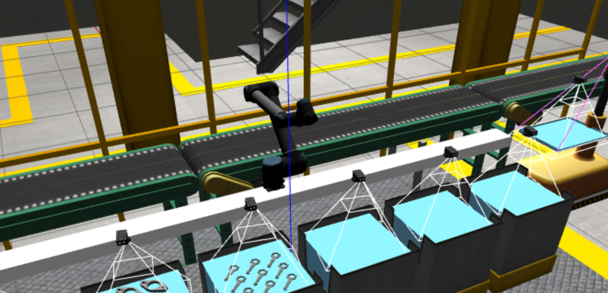

# ECSE 373 Ariac Entry



## Set up

This package relies on the ARIAC 2019 environment which you can read more about [here] (https://bitbucket.org/osrf/ariac/wiki/2019/Home). You should be using ROS noetic. 

Follow these instructions to create two separate workspaces:

```
# Create a catkin workspace for the simulation environment
mkdir -p ~/ariac_ws/src
cd ~/ariac_ws/src

# Clone the repository
git clone https://github.com/cwru-eecs-373/cwru_ariac_2019.git

# Install any missing dependencies
rosdep install --from-paths . --ignore-src -r -y

# Build the simulator environment
cd ../

# Install the simulator environment
sudo -- /bin/bash -c "source /opt/ros/noetic/setup.bash; catkin_make -DCMAKE_INSTALL_PREFIX=/opt/ros/noetic install"

# Make a workspace for the ARIAC node.
mkdir -p ~/ecse_373_ariac_ws/src
cd ~/ecse_373_ariac_ws/src

# Clone the GIT repository for this laboratory
git clone https://github.com/cwru-eecs-373/ecse_373_ariac.git

# Install any missing dependencies
rosdep install --from-paths ecse_373_ariac --ignore-src -r -y

# Add it to your ROS environment
cd ../
catkin_make
source devel/setup.bash
```

## Launching

First, the ARIAC simulation must be launched:

`roslaunch ariac_entry competition.launch`

Then, the ariac_entry node:

`rosrun ariac_entry ariac_entry`

Finally, navigate back to the gazebo simulation window and hit the play button at the bottom of the screen to start the simulation.

## About the package

The purpose of this package is to process orders in the ARIAC simulation. The node is notified when an order comes in and is given the location of a part in a bin. Then, the arm moves to a position right above the part, lowers itself, touches the part, and raises itself. This is done in a loop for every part in the order.
